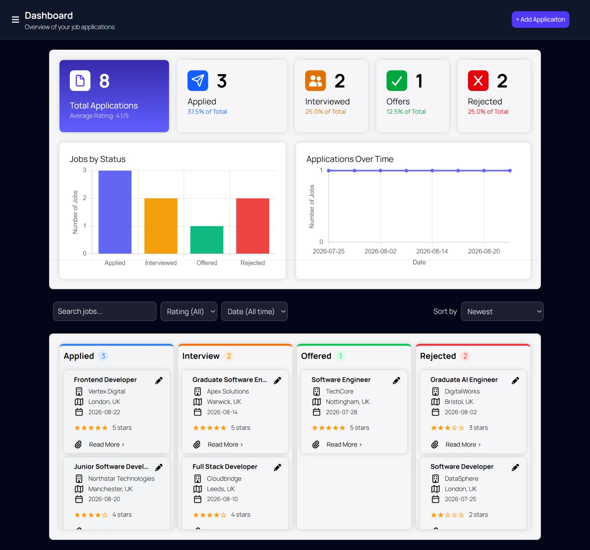
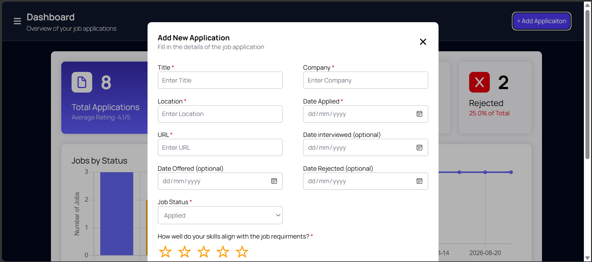
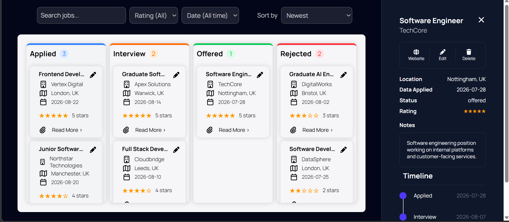

# 💼 Job Tracker

A responsive, client-side job application tracker built with **TypeScript, Tailwind CSS and Vite**.

The application uses a Kanban board to manage applications through four stages: **Applied, Interviewed, Offered and Rejected**.

Applications can be added, edited, searched, filtered, sorted and moved between stages using drag and drop. The dashboard provides an overview of applications with statistics and charts.

## 🖥️ Live Demo

https://type-script-job-tracker.vercel.app/

## ✨ Features

- 📌 Kanban board with four application stages
- 🖱️ Drag and drop between stages
- ➕ Add and edit applications
- 📄 View detailed job information
- 💾 Persistent application data using localStorage
- 📤 Export applications to CSV
- 🔎 Search by job title, company and notes
- ⭐ Five-star application ratings
- 📅 Filter by application date
- ↕️ Sort by:
  - Newest
  - Oldest
  - Highest rated
  - Lowest rated
  - Company A–Z
  - Company Z–A
- 📊 Application statistics
- 📈 Application status charts
- ✅ Client-side form validation
- 📱 Responsive layout

## 🖼️ Screenshots

### Dashboard and Kanban Board

### Add Application

### Job Details

## 🛠️ Technologies

| Technology | Use |
|---|---|
| **TypeScript** | Application logic and type safety |
| **Tailwind CSS** | Styling and responsive layouts |
| **Vite** | Development and build tooling |
| **Chart.js** | Dashboard charts |
| **HTML5** | Application structure |
| **Web APIs** | Drag and drop, DOM interaction and localStorage |

## ⚙️ Technical Implementation
### Rendering

Job data is stored in the `jobs` array and used to create the Kanban cards.

`applyFilters()` handles searching, filtering and sorting, while `renderJobs()` updates the cards shown on the board.

### Filtering and Sorting

Jobs can be:

- Searched by title, company and notes
- Filtered by rating and application date
- Sorted by date, rating and company name

### Drag and Drop

The Kanban board uses the **HTML5 Drag and Drop API**.

Jobs can be moved between stages, with their status updated automatically.

### Local Storage

Job data is saved using **localStorage**, so applications remain available when the user returns to the app.

The app also includes example jobs for first-time users.

### CSV Export

Job applications can be exported as a **CSV file** directly from the browser.

### Dashboard

The dashboard shows application statistics and charts using **Chart.js**.

### Code Structure

The application is split into separate modules for job types, dashboard functionality, statistics, CSV export and local storage.

This keeps the code organised and easier to maintain.
### TypeScript

The application uses TypeScript interfaces and enums to define job data and application statuses.

The `job` interface defines the fields stored for each application, while `JobStatus` defines the available Kanban stages.

## 📁 Project Structure

    TypeScript-Job-Tracker/
    ├── src/
    │   ├── types/
    │   │   └── job.ts
    │   ├── utils/
    │   │   ├── jobStats.ts
    │   │   ├── exportJobs.ts
    │   │   └── storage.ts
    │   ├── app.ts
    │   ├── dashboard.ts
    │   ├── shared_states.ts
    │   └── vite-env.d.ts
    ├── CSS/
    │   └── input.css
    ├── public/
    ├── index.html
    ├── package.json
    ├── tsconfig.json
    ├── vite.config.ts
    └── README.md

## 🗂️ Code Organisation

- **`src/types/job.ts`** — Job interface and `JobStatus` enum.
- **`src/utils/jobStats.ts`** — Functions used to calculate application statistics.
- **`src/utils/exportJobs.ts`** — Handles exporting application data to CSV.
- **`src/utils/storage.ts`** — Handles saving and loading application data using localStorage.
- **`src/app.ts`** — Main application logic, including jobs, rendering, filtering, sorting and drag and drop.
- **`src/dashboard.ts`** — Dashboard statistics and Chart.js charts.
- **`src/shared_states.ts`** — Shared application state and default example job data.
- **`CSS/input.css`** — Tailwind CSS input file and custom CSS.

## 🚀 Getting Started

### Prerequisites

- Node.js
- npm

### Installation

Clone the repository:

    git clone git@github.com:Usman-Iqbal-5/TypeScript-Job-Tracker.git

Enter the project directory:

    cd TypeScript-Job-Tracker

Install the dependencies:

    npm install

Start the development server:

    npm run dev

Vite will provide the local development URL.

### Production Build

Create a production build:

    npm run build

## 💡 Technical Highlights

- **TypeScript** application development
- **Interfaces and enums** for typed data
- **DOM manipulation** and dynamic rendering
- **Event handling** and event delegation
- **HTML5 Drag and Drop API**
- **Filtering and sorting** of application data
- **localStorage** persistence
- **CSV export**
- **Client-side state management**
- **Responsive UI development**
- **Tailwind CSS**
- **Chart.js**
- **Modular code structure**
- **Vite**

## 👨‍💻 Author

**Usman Iqbal**

Full-stack developer experienced in building web applications across the frontend and backend using **TypeScript, JavaScript, React, Node.js, Express and modern web technologies**.
